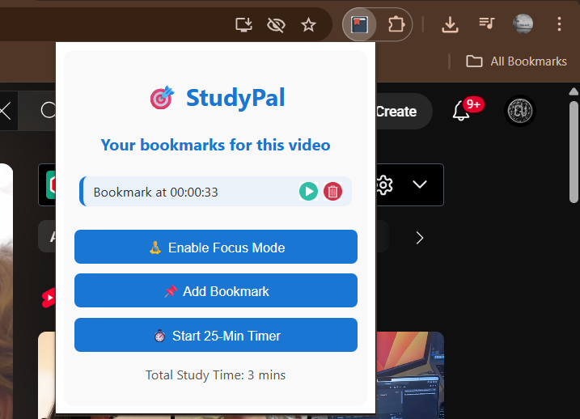

# StudyPal Chrome Extension

**StudyPal** is a simple and effective Chrome extension that helps students enhance their study sessions on YouTube with key features like Bookmarking, Pomodoro Timer, and Study Time Tracking.

---

## Features

* **Bookmarking:** Save important video timestamps for quick access anytime.
* **Pomodoro Timer:** Manage your study time efficiently with customizable Pomodoro intervals.
* **Study Time Tracking:** Automatically track and display the total time you spend studying on YouTube.

---

## Demo

### Video Demo

<video width="600" controls>
  <source src="./StudyPal.mpv4" type="video/mp4">
  Your browser does not support the video tag.
</video>

### Screenshot




---

## Installation & Usage

### Running Locally (Load as an Unpacked Chrome Extension)

1. **Clone the repository:**

   ```bash
   git clone https://github.com/SwarajMohite/StudyPal.git
   ```

2. **Open Google Chrome** and navigate to:

   ```
   chrome://extensions/
   ```

3. **Enable Developer mode:**

   Toggle the switch at the top-right corner of the page.

4. **Load the unpacked extension:**

   Click the **Load unpacked** button and select the cloned project folder (`StudyPal`).

5. **Extension is ready to use:**

   You will see the StudyPal icon in the Chrome toolbar.

---

### How to Use

* Click the StudyPal icon in the Chrome toolbar to open the popup.
* Use the **Bookmark** feature to save timestamps while watching YouTube study videos.
* Start the **Pomodoro Timer** to schedule study and break sessions.
* Track your total study time directly within the extension.
  
---

## Contact

* GitHub: [Swaraj Mohite](https://github.com/SwarajMohite)

